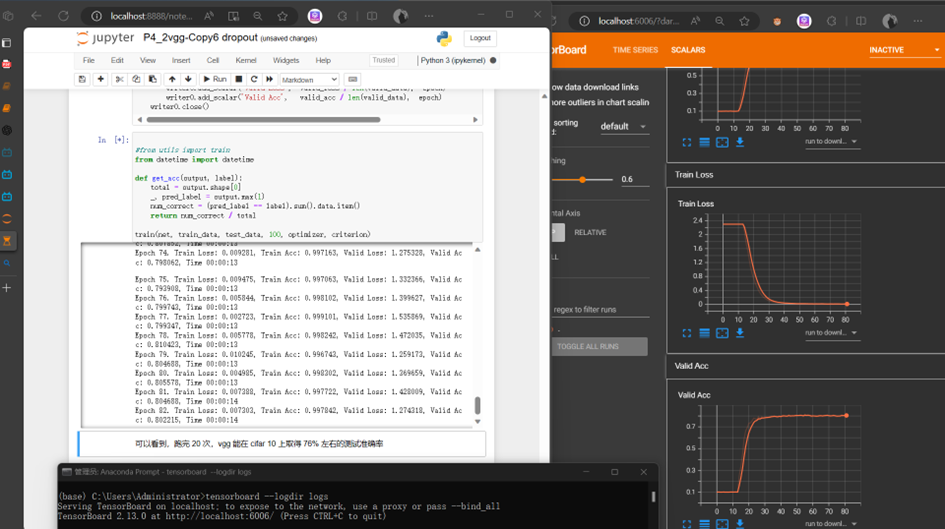
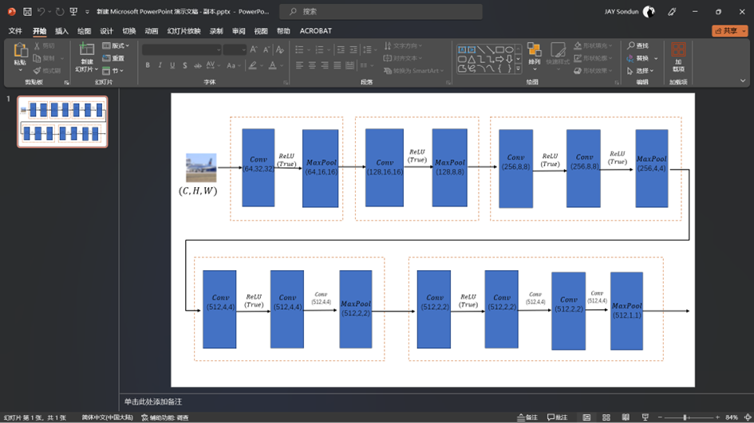
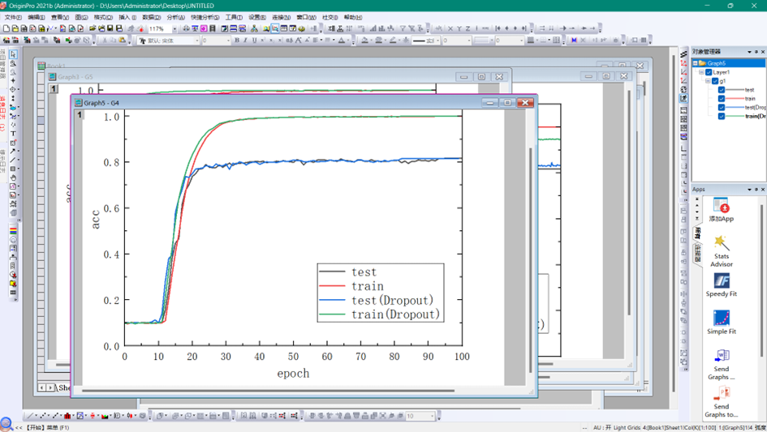
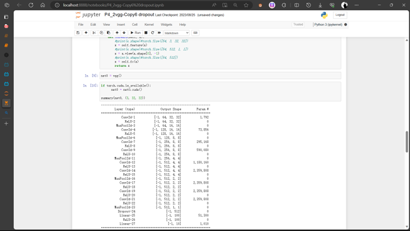
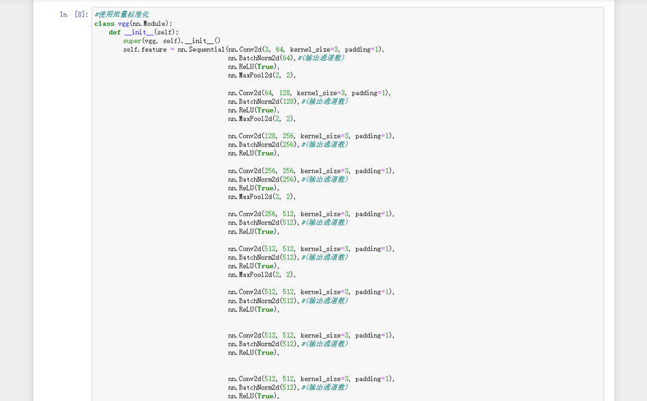
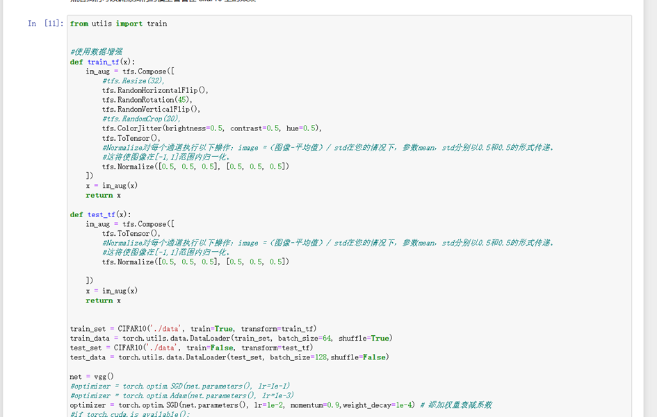
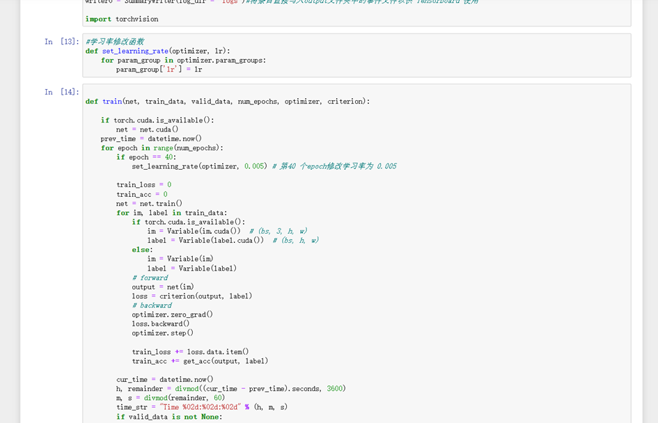
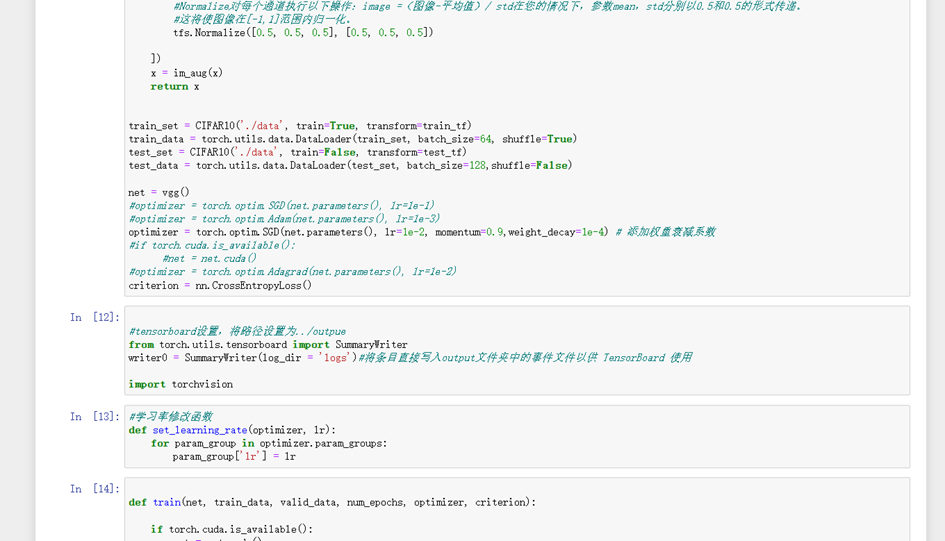
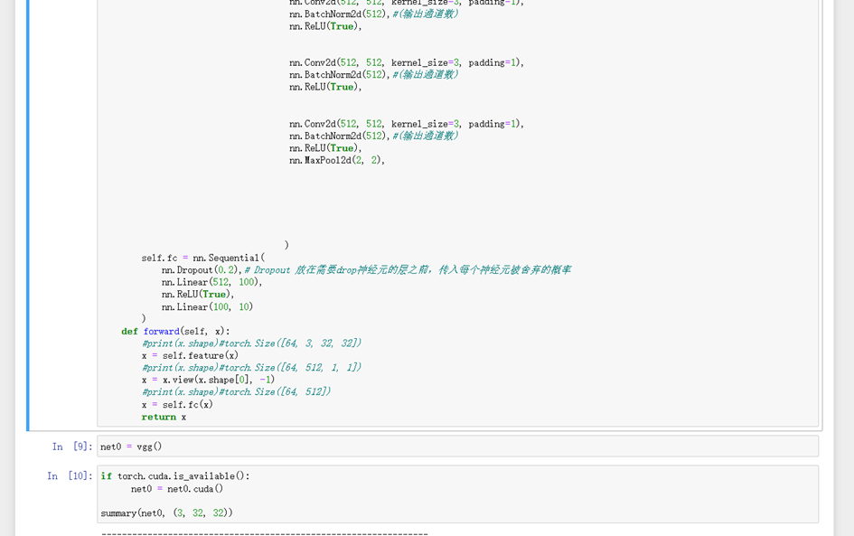

## 环境配置
使用pytorch架构，在一个RTX 3060 laptop GPU上对网络模型进行训练测试。

## 文件目录

- **outputs/**  
  训练输出文件夹，包含模型训练过程中生成的所有输出，以及origin源文件。

- **data/**  
  训练过程可视化文件夹，存放训练过程可视化的图片，以便直观地监控和分析训练状态。

- **model.png**  
  VGG模型结构图，这是一张展示VGG神经网络结构的图像文件，用于直观了解模型的层次和连接方式。

- **vgg.ipynb**  
  VGG模型代码文件，这是一个Jupyter Notebook文件，包含了用于定义、训练和测试VGG模型的Python代码。
****

# 总结
通过对vgg网络模型、训练网络相关技术进行研究，构建了一个VGG网络，并且使用各种网络优化技术对网络性能进行测试改进，最后找到了一个性能最优的优化器。

# 附录
## 一、	搭建环境
在笔记本上搭建本地环境。

使用tensorboard分析下载数据。

## 二、	模型图绘制
使用ppt画模型图

## 三、	实验结果分析图的绘制
使用origin软件

## 四、	代码实现
### 4\.1 模型的构建

### 4\.1优化器的选择
Batch normalization

数据增强

学习率衰减

权重衰减

Dropout

